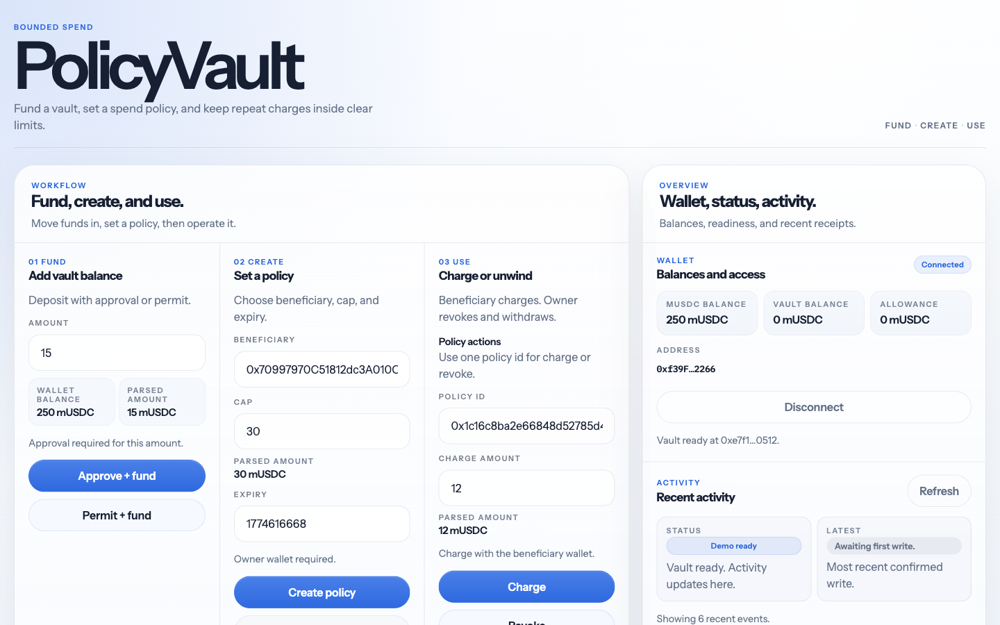
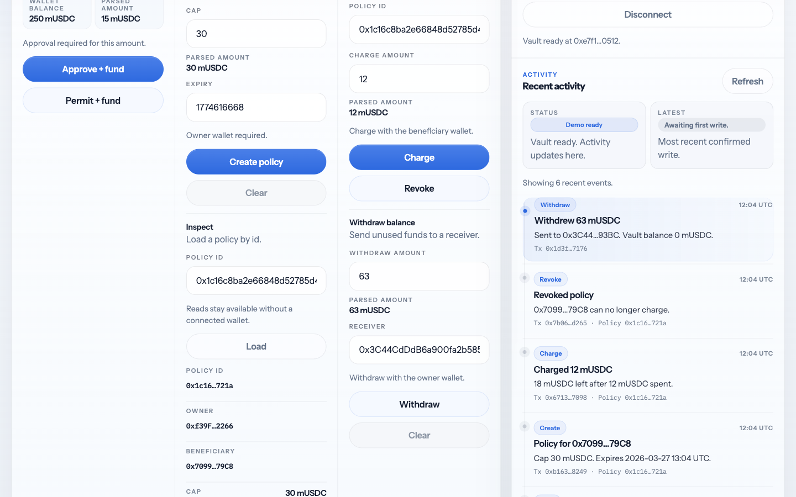
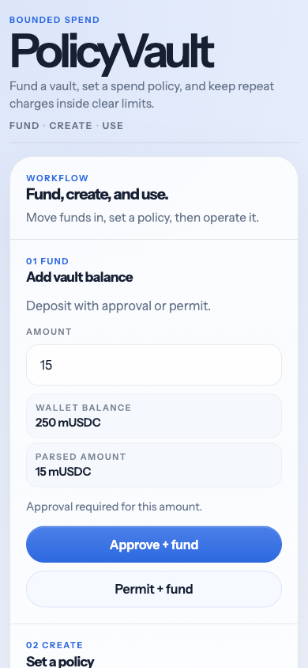

# PolicyVault

PolicyVault is a bounded ERC-20 spending MVP where an owner deposits tokens into a vault, creates a beneficiary-specific policy with a cap and expiry, and the beneficiary can only charge within those on-chain limits.

## Why this project matters

Wallet UX still leans heavily on broad ERC-20 approvals. That works, but it leaves a large blast radius once a spender has allowance. PolicyVault explores a narrower model:

- fund a dedicated vault instead of exposing the wallet balance directly
- bind spend rights to one beneficiary, one cap, and one expiry
- keep the policy state on-chain and event-visible
- support both classic `approve + deposit` and ERC-2612 `permit + deposit`

It is intentionally interview-sized: small enough to explain quickly, but concrete enough to show contract design, script discipline, ABI sync, and wallet UX trade-offs.

## Exact v1 boundary

PolicyVault v1 includes:

- one asset only, using `MockUSDC` locally
- owner-funded vault balances
- on-chain policy creation, charge, revoke, and withdraw
- deterministic policy ids
- a classic approve path and a permit path for deposit
- local deploy, seed, demo, and ABI sync scripts
- a small localhost-only Next.js dashboard

PolicyVault v1 explicitly does not include:

- multi-token support
- policy indexing or a policy list
- account abstraction
- off-chain policy creation or typed charge authorization
- production deployment targets
- backend services or an indexer

## Interface

Fund, create, and operate a bounded spend flow from one surface.



Activity stays adjacent to the workflow as live evidence.



The mobile surface keeps the same flow and hierarchy.



## Architecture

- `contracts/`
  Solidity contracts and interfaces. `PolicyVault` is the core state machine; `MockUSDC` is the local 6-decimal permit-enabled token.
- `test/`
  Hardhat tests for the contract lifecycle, happy paths, and revert paths.
- `scripts/`
  Local deploy, seed, demo, and ABI/address sync tooling. The scripts use simulation before writes where practical.
- `app/`
  A Next.js demo UI that connects a wallet, reads contract state, and drives the bounded-spend flow through wagmi and viem.
- `docs/` and `plans/`
  Architecture notes, local ops, demo guidance, roadmap, and the active ExecPlans that record how the repo was built.

## Contract state machine

The vault has two pieces of state:

- owner vault balances via `vaultBalanceOf(owner)`
- policy records keyed by deterministic `policyId`

The lifecycle is:

1. The owner deposits `MockUSDC` into the vault.
2. The owner creates a policy for one beneficiary with `cap` and `expiresAt`.
3. The beneficiary calls `charge(policyId, amount)` within the remaining cap and before expiry.
4. `charge` decreases the owner's vault balance and increases `spent`.
5. The owner can revoke the policy at any time.
6. The owner can withdraw unused vault funds.

Important rule: `createPolicy` records an authorization ceiling, not reserved escrow. Funding is enforced later at `charge` time against the owner's live vault balance.

## Security choices

- `SafeERC20` on token transfers
- `ReentrancyGuard` on external mutating paths
- checks-effects-interactions ordering on token-moving state changes
- custom errors instead of string-heavy reverts
- deterministic policy ids derived from owner, beneficiary, cap, expiry, and nonce
- simulate-before-write in the scripts and UI

## Local development flow

Bootstrap once:

```bash
cp .env.example .env
cp app/.env.local.example app/.env.local
pnpm install
pnpm compile
pnpm test
```

Then use this order:

```bash
pnpm node
pnpm deploy:local
pnpm abi:sync
pnpm seed:local
# optional after manual browser testing
pnpm demo:local
pnpm web:dev
```

Notes:

- `pnpm node` starts the localhost JSON-RPC at `http://127.0.0.1:8545`.
- `pnpm deploy:local` writes the tracked `deployments/localhost.json` artifact.
- `pnpm abi:sync` regenerates the app ABI and localhost address files from the current contract artifacts and deploy artifact.
- `pnpm seed:local` mints readable demo balances to the first three localhost wallets.
- `pnpm demo:local` runs the scripted happy path plus an intentional over-cap revert.
- For a clean manual UI walkthrough, skip `pnpm demo:local` until after browser testing so the first deposit, policy, charge, revoke, and withdraw events are still available to drive manually.

## Current UI scope

The dashboard currently supports:

- wallet state
- approve + deposit
- permit + deposit
- create policy
- load policy by id
- charge
- revoke
- withdraw
- recent event timeline

The timeline reads `Deposited`, `PolicyCreated`, `Charged`, `PolicyRevoked`, and `Withdrawn` logs directly from `PolicyVault` without an indexer.

## Readiness states

Before the dashboard claims it is usable, it distinguishes:

- `Missing local deploy`: no synced contract addresses yet
- `RPC offline`: localhost RPC is unavailable or not responding
- `No contract code`: addresses exist, but the current node has no bytecode at one or both saved addresses
- `Demo ready`: the RPC is live and both configured addresses have deployed bytecode

## Manual browser walkthrough

Owner flow:

1. Start the local node, deploy, sync ABI, seed wallets, and run `pnpm web:dev`.
2. Connect localhost account `#0`.
3. Confirm the dashboard reaches `Demo ready`.
4. Deposit through either approve or permit and confirm wallet balance, allowance, vault balance, and timeline all update after receipt.
5. Create a policy with beneficiary account `#1`, note the returned policy id, and load it by id.

Beneficiary flow:

1. Switch the wallet to localhost account `#1`.
2. Use the same policy id to charge within the cap.
3. Confirm the loaded policy now shows higher `spent`, lower `remaining`, and a matching `Charged` row in the timeline.

Owner revoke and withdraw flow:

1. Switch back to localhost account `#0`.
2. Revoke the policy.
3. Withdraw the remaining vault balance to account `#2` or another receiver.
4. Confirm the policy remains readable as revoked and the vault balance drops after withdraw.

Timeline confirmation:

1. Check that the recent event list shows deposit, policy creation, charge, revoke, and withdraw in chain order.
2. Use the manual refresh button only if you want to emphasize that the UI is reading logs directly rather than through an indexer.

## Trade-offs and future work

- single asset
- no indexer
- no policy list
- no account abstraction
- no multi-token support
- no production deployment target yet

Those trade-offs are intentional. The goal of v1 is a narrow, explainable vertical slice for bounded spend, permit UX, and event-visible policy state.
